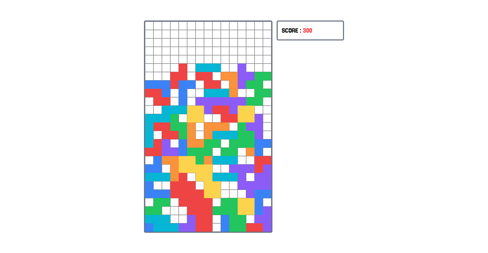

# Tetris

A simple **Tetris clone** built with **React** ...

---

## Technical Stack

<div align="center">

| Icon                                                                                                          | Technology       | Purpose        |
| ------------------------------------------------------------------------------------------------------------- | ---------------- | -------------- |
|  | **TypeScript**   | Type safety    |
|            | **React**        | User interface |
|                    | **Tailwind CSS** | Styling        |

</div>

---

## Main Features

### Start a New Game


### Play and Score Points



### Game Over — Start Again


---

## How to Start the App

### 1. Clone repository

```bash
git clone <your-repo-url>
cd tetris
```

### 2. Install dependencies

Install npm packages:

```bash
npm install
```

---

The application should now be running locally.
